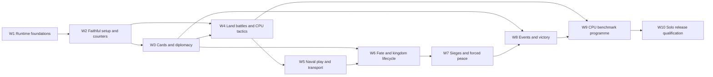

# Divine Right Solo Game Implementation Plan

> **For agentic workers:** Use `superpowers:executing-plans` to execute one work package at a time. Steps use checkboxes for tracking. This document is the programme roadmap; the first package has a separate executable plan. Completing this planning PR does not authorise implementing the whole roadmap.

**Goal:** Deliver a faithful Divine Right Basic Game that a human can play from setup through final scoring against a capable, fair CPU opponent.

**Architecture:** Retain React, Vite, boardgame.io, the SVG board, and the existing rule helpers. Repair runtime ownership and turn progression first, then implement rules as small domain modules connected to real game moves, saved decisions, UI controls, and CPU decisions. Keep one authoritative runtime state and derive views and legal actions from it.

**Tech Stack:** TypeScript, React 18, boardgame.io 0.50, Vite, Vitest, Playwright, Python conformance tooling; Node `24.x`, npm `11.x`.

**Spec:** Product intent in `docs/prd/divine-right-prd.md`, qualified by the release contract below and the user's 2026-09-06 choice: **solo play against a capable CPU first**. Rule authority remains the supplied physical-game reference material under `docs/refs/`.

## Global constraints

- Node `24.x`; npm `11.x`; bootstrap with `npm run bootstrap`.
- Never change `docs/refs/` without explicit authorisation.
- Rule validation functions return `DomainResult` (`{ ok: boolean, reason?: string }`) — never throw for rule violations.
- Keep `stage` as the only intentional persisted boardgame.io flow mirror; do not introduce another phase/current-player copy.
- Reference documents outrank conformance fixtures and implementation. Conflicting fixtures must be corrected with traceable evidence, not followed blindly.
- Every new conformance test ID must have a coverage-matrix entry and an exercised helper/runtime assertion in the same change. Unsupported cases are deferred explicitly.
- No networking, accounts, cloud saves, telemetry, framework replacement, or Advanced Game expansion in the first solo release.
- Every implementation PR includes its own tests, required `npm run test:local:gate` with no skips, diff review, applicable AGENTS learning, commit, push, PR, and GitHub Actions monitoring through `gh-fix-ci`.

## 1. Recommendation and release contract

Build forward from this repository. Its map, reference loaders, persistence envelope, conformance harness, portable browser tests, and many pure helpers are useful. Replacing the application would discard working assets without resolving the hardest problems: faithfully representing the rules and exercising them through real play.

Three approaches considered:

| Approach | Benefit | Cost | Decision |
|---|---|---|---|
| Repair foundations, then deliver complete rules interactions with CPU support | Reuses working code; each milestone makes solo play better | Requires honest reclassification of existing coverage | **Recommended** |
| Finish every helper/fixture before connecting runtime and UI | Simple subsystem work queue | Repeats the current adapter-only trap and delays playable feedback | Reject |
| Rewrite the engine or replace boardgame.io immediately | Freedom to choose new interfaces | Large regression surface; no demonstrated need yet | Reject unless W1 proves a specific framework constraint cannot be met |

The first release is **Basic Game solo**, initially one human against one CPU, with all 11 Basic Game home kingdoms available. The underlying setup and turn scheduler must support 2–6 players and be tested at both ends of that range; exposing additional CPU seats is a follow-up unless it is already complete without delaying the two-player release.

The Basic Game includes diplomacy, personality and diplomacy cards, events, land and naval movement, transport, combat choices, sieges, leader fate, death/capture, forced peace, special kingdom rules, and scoring. The folder name `chunk_3_advanced_mechanics` does **not** make diplomacy or sieges Advanced Game rules. Earlier PRD exclusions of naval play, assassination, duels, leader fate, and forced peace cannot coexist with a Basic Game completeness claim.

Optional re-entry after elimination is an explicit game option, disabled by default. Its enabled path must request the remaining players' assent and implement the score reset and random eligible kingdom; a CPU must respond through the same decision system. Never silently grant re-entry.

Advanced Game data files do not establish a complete Advanced Game rules specification. Inventory missing Advanced rules and components after the Basic release; do not infer them from faction names or assets.

## 2. Repository review: what is actually present

Reviewed 2026-09-06 at `f630548`; fetched `origin/main` at `ae6c35c`, whose tracked content is identical. Existing untracked `.DS_Store` files and `.claude/worktrees/` were left alone. No reference files or application code were changed for this review.

### Verified baseline

- Required gate passed using an isolated Node 24 runtime: **23 test files, 342 tests, 11 portable Chromium E2E tests; no skips**. Command: `npm exec --yes --package=node@24 --package=npm@11 -- npm run test:local:gate`.
- Lint has one existing `App.tsx` size warning. Production build and conformance validation pass.
- Coverage is scoped to only `rules.ts`, `dr3-game.ts`, and `save-load.ts`; its aggregate is 74.16% statements / 59.57% branches / 80.05% lines. This is not coverage of all game rules.
- There are **542 fixture cases in 28 files**. The report labels 2 files runtime-covered, 10 adapter-only, and 16 unwired. These are file-level wiring labels, not percentages of implemented rules.
- `core-turn-combat.runtime.test.ts` contains seven tests, five explicitly named after fixture IDs. Several invoke domain helpers directly on cloned state; it does not run all 82 movement/combat fixture cases through game moves. Its `overrideGameState` helper changes the client view, not the underlying reducer state.
- The first sandboxed gate attempt could not bind the local browser server. Re-running with local-server permission succeeded. The default shell has Node 25; that run is not the supported-toolchain evidence above.
- This review did not establish iOS visual correctness, physical-device performance, or CPU playing strength.

### Findings that determine implementation order

| Priority | Finding and evidence | Consequence | Owner |
|---|---|---|---|
| P0 | `src/game/dr3-game.ts:64`, `:188`, `:197`: each A–F step is a separate phase with its own turn configuration. A real-client probe went `ctx.turn` 1→7 through A–F and End Turn, while current player remained `0`, `G.currentTurn` remained `1`, and `activePlayerIndex` remained `0`. | The main turn loop does not hand control to the opponent or advance game rounds. | W1 |
| P0 | `src/game/dr3-game.ts:27` returns a shallow spread. Domain handlers replace `G.rngState` on that temporary object, while nested mutations happen to reach runtime state. A client event and card draw left runtime RNG `[3611474090]` unchanged. | Runtime randomness repeats; any future replacement of a top-level field can disappear. | W1 |
| P0 | `src/engine/domain/rng.ts:23–34` takes low LCG bits modulo six. Adjacent outputs have opposite parity. A chained 10,000-roll probe from seed `review` produced only totals 3, 5, 7, 9, 11. | Even event totals are unreachable; unmodified opposing dice cannot tie. Seeded does not mean suitable dice. | W1 |
| P1 | `src/engine/domain/setup.ts:60` drops definitions without `startHex`, including Zorn's eight Nithmere armies. Setup also places 56 neutral unit records on the map, assigns no personalities, and makes a 20-entry diplomacy deck from personality IDs (`:112`). | Starting positions, reserves, hidden information, and cards do not represent Basic Game setup. | W2 |
| P1 | `src/engine/domain/rules.ts:224` directly activates/deactivates any named faction, without diplomatic eligibility, cards, die roll, ambassador state, or player-kingdom protection. Draws create random IDs without consuming a finite deck. | Diplomacy is a debug shortcut, not game rules. | W3 |
| P1 | `src/engine/domain/rules.ts:458–561` accepts duplicate attack declarations (verified), resolves FIFO from one attacking hex, removes losses by record order, and omits declaration closure, retreat, terrain, player-selected losses, advance, and attack limits. | The existing combat slice cannot be promoted to complete combat. | W4 |
| P1 | Movement validates adjacency, MP, and hostile occupancy, but does not integrate activation delays, end-of-movement allied stacking, leader movement, castle interior/exterior state, or naval transport. | Pure helpers and pathfinding tests do not prove runtime movement completeness. | W2/W4/W5 |
| P1 | Events log names only. Siege resolution has no declaration move, changes only a flag on success, and counts record IDs instead of counter quantities. Victory sums faction fields that no rules action awards. | There is no complete event/siege/scoring game loop. | W6/W7/W8 |
| P1 | `src/persistence/save-load.ts` saves only `G`; `restoreSnapshot` assigns `G` and changes phase, without restoring the framework's current player or full progress. Tests restore stage within one player's flow. Runtime validation predominantly checks shapes. | Cross-player, pending-choice, terminal-state and deterministic continuation need explicit round-trip tests. | W1, then every package |
| P1 | `scripts/report_conformance_coverage.py:30–38` classifies an entire file by finding its path in test source. Some adapter assertions assert fixture values, such as `expect(expected.all_retreat_on_first_success).toBe(true)`, rather than an executed result. | A green report can overstate both assertion quality and runtime completeness. | W1, then every package |
| P1 | `src/ai/cpu-bot.ts` uses shallow MCTS without a game-specific evaluation, a fixed bot seed, and fallback actions triggered by unchanged phase even when a legal within-phase action succeeded. `DR3Game.ai.enumerate` can offer resolution with no queued battle. UI requires a manual CPU button. | Bounded action counts do not establish legal, complete, capable solo play. | W4, W9 |
| P2 | `src/App.tsx` is 627 physical lines, combines client identity, automation hooks, board interactions, saves and actions, and starts a hard-coded game immediately. | Add panels and session ownership incrementally as features arrive; avoid adding every new decision to this component. | W2 onward |
| P2 | CI runs `npm test`, not the local coverage gate or wiring report. Pages deployment runs a build independently of verification. `docs/README.md` still calls a superseded February plan active. | Local and remote acceptance can drift; release deployment needs a verified commit. | W1/W10 |

The review probes were kept under `/private/tmp/dr3-repo-review/`, outside the repository. Their scenarios and expected regression tests are preserved in the W1 plan; temporary output is not a long-term evidence dependency.

## 3. Architecture decisions

### Runtime and flow

Keep boardgame.io as the authoritative turn executor. Replace A–F phase transitions with stages inside a single player turn. A game round is a domain concept: all currently eligible players act once in its shuffled order, then scheduled round effects are applied and the round advances. Do not use `ctx.turn` as the 20-round track.

Use one audited bridge to execute domain handlers and commit changed runtime fields. Rejections must leave state, pending decisions, RNG and log unchanged. Do not attach the static map to saves. Remove redundant active-player state where it duplicates framework state; translate framework actor context at the boundary.

Persist genuine domain facts: round order, round completion, card zones, counter locations, castles, restrictions with explicit expiry, prisoners, and player-earned points. Do not add caches of the same facts to each subsystem.

### Counter, location and lifecycle model

Represent physical counters individually, with stable IDs derived from definition ID and counter index. Current aggregated `count` rows cannot express splitting eight armies, selecting individual losses, distributed deployment, or cargo. Expand these records once in W2; retain `definitionId` to validate original placement and replacement limits. UI stacks are derived groups of counters.

Use one discriminated location per counter: map hex with inside/outside castle position, aboard a named fleet, available reserve, eliminated reserve, scheduled return, prison, or castaway. A passenger must not simultaneously have an independent map position. Fleet movement derives passenger position; destruction resolves cargo and leader fate in one transaction.

Mercenaries require explicit controlling player, reserve ownership and legal transfer. The current `return unit.isMercenary` ownership shortcut must disappear before mercenaries enter play.

Use a castle record keyed by the reference city ID for plunder and occupation; city identity is not proof of a castle. Derive current friendly status from rules and occupancy. Troll cities must remain enterable and unsiegeable.

### Player decisions and effects

Introduce a serialisable `PendingDecision` discriminated union when the first choice-driven subsystem is implemented. Every case contains a stable decision ID, responsible player, legal choice data, rule references, and continuation data. Cases include event loss/replacement choices, retreat, casualties, advance, siege reactions, prisoners, and optional re-entry.

Only the responsible player may resolve a pending decision; stale IDs, wrong actors and illegal options reject without side effects. Automatic continuation must stop at the next required choice. Defending-player choices must work during another player's turn through boardgame.io active-player stages. CPU and human decisions use exactly this path.

Keep timing concrete: player-turn end, game-round start/end, next movement phase, and a specified player's next turn are distinct deadlines. Use typed timing records in the subsystem that owns them and a small coordinator for boundary processing. Avoid a general-purpose scripting engine for the rulebook.

### Rules, UI and CPU contracts

Extract domain modules only when implementing them: `turns`, `diplomacy`, `events`, `movement`, `combat`, `siege`, `leaders`, `victory`. Keep `rules.ts` as a compatibility facade during migration. Existing pure helpers are reused after checking them against the references.

Create a shared legal-action service, consumed by UI and CPU, with a discriminated `GameAction` union. Action descriptions include actor, arguments, relevant rule references and human-readable rejection explanations. Validation remains authoritative in the executed move; enumeration alone does not authorise an action.

The CPU sees public board state, its own hand and revealed personalities. It must not use an opponent's hand, unrevealed personality, deck order or the future game RNG stream to select actions. Keep a separate deterministic policy seed for tie-breaking/search. Full state remains private to the local game executor; future multiplayer transport can reuse the same observation boundary.

Do not increase MCTS iterations to compensate for a missing objective. Start with explicit evaluation of monarch survival, VP opportunities, army preservation, diplomacy value and castle pressure; improve decisions using bounded search and honest hidden-state sampling after benchmarks exist.

### Saves, undo and random outcomes

Version rules-state/RNG changes explicitly. Prototype v2 saves contain insufficient data to recover a faithful full-game state, so preserve files and reject unsupported legacy imports clearly rather than inventing lost state. Each later schema change must define a migration or a specific incompatibility message.

Restore a complete executable session, not merely a displayed stage. Save and load at every pending choice; check actor, round, turn order, RNG continuation and terminal result. Honour the PRD's undo requirement: allow reversible own actions before revealing hidden information or rolling dice; prevent undo from becoming a re-roll/card-peeking mechanism.

## 4. Dependency order and milestones

The parallel edges describe dependencies, not a requirement to use parallel agents. CPU actions and tactical cases accompany W3–W8; W9 consolidates whole-game strength. A human-only release is not an intermediate product commitment.

| Milestone | Packages | Observable result |
|---|---|---|
| A — trustworthy simulation | W1–W2 | Exact setup, real player handoff, reproducible rolls, resumable sessions, honest coverage |
| B — solo tactical preview | W3–W4 | Human and CPU recruit allies and fight complete land encounters with choices; marked incomplete |
| C — Basic Game rules candidate | W5–W8 | All mandatory Basic rules reachable; seeded games terminate and score correctly |
| D — capable solo release | W9–W10 | CPU meets tactical/whole-game criteria; full human game verified on target browsers |

## 5. Implementation work packages

Each package is split into the reviewable deliveries below. Each delivery follows the red–green–refactor cycle, adds executable conformance coverage, runs the local gate, and opens a small PR. UI and CPU support are part of the listed delivery, not a later wiring project.

### W1 — Repair simulation foundations and the evidence gate

**Detailed plan:** `docs/plans/2026-09-06-runtime-foundations-plan.md`.

**Files:** `src/game/dr3-game.ts`, `src/game/runtime-state.ts`, `src/engine/domain/rng.ts`, `src/engine/domain/rules.ts`, `src/types/game-state.ts`, `src/persistence/save-load.ts`, existing paired tests, `src/test/conformance/harness.ts`, `scripts/report_conformance_coverage.py`, `vitest.config.ts`, `.github/workflows/ci.yml`.

- [ ] W1.1 Persist all domain changes atomically; prove failed moves do not consume RNG or queued work.
- [ ] W1.2 Replace low-bit dice sampling; test deterministic continuation and reachability of all 36 die pairs. Version the RNG state.
- [ ] W1.3 Fix A–F steps within one player turn, random round order, 2–6 player progression and exactly 20 completed rounds.
- [ ] W1.4 Rehydrate executable sessions across players, rounds and gameover; implement the defined save incompatibility handling.
- [ ] W1.5 Report executed coverage per case ID, fail on unhandled/unknown/stale mappings, and make CI run the same no-skip base/portable gates.

**Exit:** A no-action deterministic driver completes all 20 rounds for 2 and 6 players, each eligible player acts exactly once per round, both actors can make moves after reload, and the final legal turn executes before gameover. Current fixture coverage is honestly reported as partial where appropriate.

### W2 — Faithful setup, counters, reserves and session UI

**Modify:** `src/engine/domain/setup.ts`, `src/data/load-refs.ts`, `src/types/unit.ts`, `src/types/faction.ts`, `src/types/game-state.ts`, `src/game/runtime-state.ts`, `src/persistence/save-load.ts`, `src/App.tsx`, `src/ui/HexBoard.tsx`.
**Create:** `src/engine/domain/deployment.ts`, `src/engine/domain/legal-actions.ts`, `src/types/decisions.ts`, `src/ui/DecisionPanel.tsx`, `src/ui/NewGamePanel.tsx`, `src/ui/UnitInspector.tsx`, and paired tests; `src/test/conformance/runtime/setup.runtime.test.ts`. Extend `src/game/session.ts` created by W1.

- [ ] W2.1 Introduce individually identifiable counters and one location model. Preserve exact definition totals across board, reserves, eliminated and scheduled units; migrate all existing movement/combat callers together. Establish the shared legal-action and serialisable decision contracts for deployment; later packages extend their discriminated unions with each implemented choice.
- [ ] W2.2 Implement Basic setup: 11 eligible kingdoms, random identity option plus explicit chosen-faction mode, 20 separately shuffled personality cards assigned only to non-player monarchs, neutral reserves, 14 mercenary armies and 6 fleets. Reference the rules for pool counts; do not add canonical files.
- [ ] W2.3 Implement Zorn's eight nonadjacent mountain/pass placements and replacement eligibility, Troll city treatment, Dwarven deployment, capital monarch/ambassador locations. Support human selection and deterministic CPU placement.
- [ ] W2.4 Move client creation into a restartable session owner. Add new game/faction/seed controls, explicit prototype scenario labels, save compatibility messages and derived counter-stack selection.

**Tests:** Fixtures for sections 3–6, 9, 30, 31 plus new setup cases wired in the same PR. Test duplicate/unknown player factions, invalid player counts, illegal Zorn adjacency, neutral units absent from board, personality uniqueness, pool conservation and save/reload of partial deployment. Existing board contract and intentional visual checks must still pass.

**Exit:** Every selectable home kingdom starts with the correct physical pieces; all excluded Basic components are absent. A new game and a loaded game have the same playable state. No aggregated army row is lost or treated as a single casualty.

### W3 — Real diplomacy, finite cards and hidden information

**Modify:** `src/types/cards.ts`, `src/types/faction.ts`, `src/engine/domain/rules.ts`, `src/game/dr3-game.ts`, `src/game/runtime-state.ts`, `src/data/load-refs.ts`, `src/ai/cpu-bot.ts`.
**Create:** `src/engine/diplomacy/diplomacy.ts`, `src/engine/diplomacy/cards.ts`, `src/engine/diplomacy/personality-effects.ts`, `src/game/player-view.ts`, `src/ui/DiplomacyPanel.tsx`, paired tests and `src/test/conformance/runtime/diplomacy.runtime.test.ts`.

- [ ] W3.1 Derive a 32-card Basic diplomacy catalogue from rule 13.3 multiplicities. Draw from a shuffled finite deck, discard on use, reshuffle only discarded cards when needed; no trading, phantom cards or duplicates across zones.
- [ ] W3.2 Translate all 20 personality descriptions into explicit effects with per-card source mapping and tests. Keep assignment hidden until the rule reveals it. Add player/CPU observation filtering.
- [ ] W3.3 Activation/deactivation: eligible targets, thresholds 6/7, one optional ploy before rolling, automatic success when guaranteed, personality effects, penalties, delayed activation movement and end-of-player-turn removal. Own/enemy player monarchs cannot be recruited as non-player allies.
- [ ] W3.4 Ambassador availability and per-target banishment/penalty state; legal pass when no function is possible. Preserve the distinctions needed for later assassination/duels and forced peace. Add a target/card/outcome UI and CPU card-value choices.

**Tests:** Runtime cases for 12, 13, 14, 15 and 16, including guaranteed success, guaranteed failure, discard on failure, exhausted deck with empty discard, wrong player's card, immediate event activation versus delayed diplomatic activation, and save with a card committed before a roll. Assassination/duel cases remain explicitly deferred to W6.

**Exit:** Human and CPU diplomacy use the real deck and rules. Hidden-card permutations cannot change CPU decisions for an otherwise identical observation.

### W4 — Complete land movement and combat, with tactical CPU

**Modify:** `src/engine/domain/rules.ts`, `src/engine/movement/movement.ts`, `src/engine/map/pathfinding.ts`, `src/engine/combat/combat-resolution.ts`, `src/engine/leaders/leader-rules.ts`, `src/types/combat.ts`, `src/game/dr3-game.ts`, `src/App.tsx`, `src/ai/cpu-bot.ts`.
**Create:** `src/engine/combat/combat-state.ts`, `src/ui/CombatPanel.tsx`, `src/ai/evaluate-position.ts`, `src/test/conformance/runtime/land-combat.runtime.test.ts` and paired unit tests. Extend the legal-action, decision-type and decision-panel modules from W2.

- [ ] W4.1 Route movement and pathfinding through the same terrain/edge/ownership validator. Implement split/group movement, leader-assisted movement and restrictions, neutral-border consequences, and allied stacking at movement completion. Establish a concrete reference-data audit for hexside crossing before relying on inferred river/coast geometry.
- [ ] W4.2 Extend the legal-action/decision contract for battles and add a minimal castle inside/outside distinction. Commit all attack declarations before resolution; represent participant counter IDs, split and combined attacks; enforce unit and target attack limits.
- [ ] W4.3 Let the attacker choose battle order and defender choose retreat; enforce mixed-stack retreat order, displacement without place-swapping, surrounded rejection and repeat-retreat restrictions. Let each owner choose losses; apply terrain and leader bonuses; support some/all/no advance. Persist each choice and dispatch the defender's CPU/human response correctly.
- [ ] W4.4 Add tactical CPU selection using shared legal actions: protect monarch, avoid impossible attacks, prefer favourable terrain/odds, choose useful retreats and low-cost casualties, move toward a declared objective. Replace phase-unchanged fallback detection with committed-action/state-revision detection.

**Tests:** All land-applicable 18, 19, 23, 24, 25 and 26 cases through runtime moves. Scenarios: duplicate declaration rejected; no new declarations after closing; two hexes combine on one target; split attacks consume every participating counter once; wrong defender response rejected; failed retreat resolves battle; mountain/pass bonuses alter outcome; save/reload at casualty choice.

**Exit:** A human and CPU can finish a complete land encounter without automatic player choices or debug seeding. Naval and leader-death consequences stay explicitly outside this preview until W5/W6; the UI does not claim Basic completeness.

### W5 — Fleets, transport, ports and boundary rules

**Modify:** `src/engine/movement/movement.ts`, `src/engine/map/terrain.ts`, `src/engine/domain/legal-actions.ts`, `src/types/unit.ts`, `src/ui/UnitInspector.tsx`, `src/ui/HexBoard.tsx` and runtime validation.
**Create:** `src/engine/movement/naval.ts`, `src/engine/movement/transport.ts`, `src/test/conformance/runtime/naval.runtime.test.ts` and paired tests.

- [ ] W5.1 Wire fleet movement and embark/debark terrain/edge restrictions; establish friendly castle and non-castle ports and mercenary fleet placement.
- [ ] W5.2 Implement capacity, cargo counter assignment, movement expenditure, legal unloading and fleet continuation. Transported units cannot move independently or contribute to regular attacks.
- [ ] W5.3 Resolve fleet destruction and carried armies transactionally; emit explicit leader-fate consequences for W6. Add cargo selection and transport plans to UI and CPU.

**Tests:** Runtime fixtures 20–22, 25.6, supporting 9/10/24 and transport/terrain interactions. Cover full capacity, illegal cargo sharing, movement spent twice, impossible disembarkation, land attacks across all-sea boundaries, fleet attacks across all-land boundaries, cargo loss and save/reload aboard fleet.

**Exit:** A human and CPU can carry a force between ports, disembark and fight legally; every physical counter is accounted for exactly once.

### W6 — Leader fate, elimination and kingdom lifecycle

**Modify:** `src/engine/leaders/leader-rules.ts`, `src/types/faction.ts`, `src/engine/diplomacy/diplomacy.ts`, `src/game/dr3-game.ts`, runtime validation and CPU decisions.
**Create:** `src/engine/leaders/fate.ts`, `src/engine/domain/kingdom-lifecycle.ts`, `src/engine/leaders/prisoners.ts`, `src/test/conformance/runtime/lifecycle.runtime.test.ts` and paired tests.

- [ ] W6.1 Implement all fate triggers with per-player-turn/per-enemy-movement limits, lone-leader passage, capture/kill and fleet loss. Resolve castaway placement, Isle of Fright restrictions, rescue and penalties.
- [ ] W6.2 Implement confusion, successor timing/personality, border-triggered recovery, end-turn removals that preserve eliminated counters, prisoner placement, execution, release and player elimination. Retain eliminated players' VP ownership.
- [ ] W6.3 Add once-per-game assassination, ambassador-pair duels, recovery and inherited penalties; wire diplomacy choices and CPU risk selection.
- [ ] W6.4 Add optional re-entry through unanimous decision responses and eligible-kingdom random selection; handle no remaining active players without an infinite scheduler loop. Final scoring still accounts for eliminated players.

**Tests:** Runtime 26–28 plus 12 and 15 interactions. Include no double fate roll for advance, capture without an eligible prison, prisoner release when captor deactivates, banishment expiry, death in another player's turn, posthumous ranking, and reload during confusion/return schedules.

**Exit:** Losing a monarch causes the correct sequence of game consequences and never leaves a phantom active player or stranded decision.

### W7 — Real sieges, castle plunder and forced peace

**Modify:** `src/engine/siege/siege-check.ts`, `src/engine/siege/siege-resolution.ts`, `src/types/siege.ts`, `src/engine/domain/legal-actions.ts`, `src/engine/combat/combat-state.ts`, kingdom lifecycle and runtime validation.
**Create:** `src/engine/siege/siege-state.ts`, `src/ui/SiegePanel.tsx`, `src/test/conformance/runtime/siege.runtime.test.ts` and paired tests.

- [ ] W7.1 Persist castle state, declare a siege as soon as all three requirements are satisfied, support declarations by any eligible player at legal interruption points, keep separate players' sieges separate, and reevaluate siege validity after every relevant move, retreat, death or control change.
- [ ] W7.2 Resolve siege rolls using physical counter strengths, intrinsic defense, land/sea zone coverage, port fleet requirements and inside/outside defenders. Apply casualties, leader fate, permanent plunder, post-siege movement/attack restrictions and optional advance.
- [ ] W7.3 Implement sorties, siege relief, the two-hex advance exception and transported-unit siege exceptions. Add CPU siege-force assembly, relief and abandonment decisions.
- [ ] W7.4 Implement royal-castle and prisoner forced peace, contested modifiers, exclusivity between applicable attempts, duration, removal timing and border-violation recovery. Ordinary diplomacy remains separately available as the rules allow.

**Tests:** All 73 siege fixture cases reviewed and exercised, plus runtime 10/15/20/25/28/31 interactions. Include empty intact enemy castle entry rejection, Troll city non-siege, siege breaking when a covering fleet leaves, casualties invalidating force sufficiency, two players not pooling strengths and permanent plunder across reactivation.

**Exit:** Castle conquest is a complete playable interaction with real state changes and a scoring event; no flag-only resolution remains.

### W8 — All random events, replacements and victory

**Modify:** `src/types/events.ts`, `src/engine/domain/rules.ts`, `src/types/game-state.ts`, turn coordinator, siege/lifecycle handlers and UI log.
**Create:** `src/engine/events/random-events.ts`, `src/engine/events/replacements.ts`, `src/engine/victory/scoring.ts`, `src/ui/ScorePanel.tsx`, `src/test/conformance/runtime/events-victory.runtime.test.ts` and paired tests.

- [ ] W8.1 Implement each 2d6 event result with its real target selection, impossible-event no-op, force restrictions, reserve changes and expiry. Roll 6 returns two regulars; roll 10 returns one regular or mercenary. Help From Afar activates immediately. Add CPU event choices.
- [ ] W8.2 Implement blocked original-placement rules, mercenary placement/stealing, pool conservation, Troll regeneration before event losses and Zorn replacement adjacency.
- [ ] W8.3 Award player-owned VP at the causal action, exactly once per plundered castle and per eligible capture/kill occurrence. Use 5× intrinsic defense for enemy castles, 10× for enemy royal castles, 30/40 for capture/kill of enemy allied monarchs and 70 for enemy player monarch capture/kill. Assassination and execution award no additional kill points.
- [ ] W8.4 Produce rankings after the final player turn of round 20; preserve posthumous winners, points after ally deactivation, recapture scoring and permanent plunder. If the supplied source gives no tie-break, display equal-ranked tied players explicitly rather than awarding victory by object iteration order; record this as a digital presentation convention.

**Tests:** Runtime 8/9/11/29/30 plus integrated diplomatic/siege/lifecycle scenarios. Force each event result through the test RNG boundary; never add arbitrary die selection to production moves. Test all scoring paths and exclusions, repeated resolution, restore/replay, and a last-player round-20 scoring action changing the winner.

**Exit:** There is a complete Basic Game from setup to final rankings, with every required event and scoring path exercised through real commands.

### W9 — Prove a capable, fair CPU

**Modify:** `src/ai/cpu-bot.ts`, `src/ai/evaluate-position.ts`, `src/game/player-view.ts`, `src/engine/domain/legal-actions.ts`, session ownership and `src/App.tsx`.
**Create:** `src/ai/cpu-worker.ts`, `src/ai/benchmarks.ts`, `src/test/conformance/runtime/cpu.runtime.test.ts`, `src/test/ai/` scenario tests, `docs/ai/cpu-benchmarks.md`.

- [ ] W9.1 Enumerate and execute every legal decision category, including out-of-turn defense, deployment, events, naval cargo, prisoners, forced peace and gameover. A legal committed action never triggers an accidental extra fallback action.
- [ ] W9.2 Evaluate VP opportunity, monarch survival, military odds/terrain, ally value/expiry, reserve availability, transport, siege concentration and endgame urgency. Use bounded search only over legal candidates and sample hidden information from the CPU observation, never real concealed state.
- [ ] W9.3 Run decisions in a worker with cancellation/version checks. Schedule CPU turns automatically, show thinking state, allow saving between decisions and reject stale results after load/new game.
- [ ] W9.4 Publish reproducible benchmark seeds, faction/seat pairings, policy version and results. Keep development scenarios and held-out evaluation seeds separate.

**Capability acceptance:**

- 100% legal actions; no unhandled choice, stalled game or steps-cap escape in 1,000 seeded two-player simulation games. Exercise six-player scheduler/decision correctness in a smaller 100-game run.
- Pass explicit tactical cases: save an exposed monarch; avoid a doomed attack when a safe useful move exists; combine attackers; exploit defensive terrain; choose legal low-value losses; retreat to safety; value effective diplomatic ploys; assemble a legal siege; rescue a castaway; complete transport; select meaningful replacements; prefer a decisive VP action in the final round.
- Score at least 70% (win=1, draw=0.5) over 200 held-out games against a documented legal-random baseline, with paired faction/seat swaps, and beat the initial deterministic greedy baseline over the same set. Report distribution, not just average steps. These are proposed product thresholds, not measured current capability or a claim of expert human strength.
- Observation-equivalent states with different concealed hands, personalities, deck order and game RNG state yield the same policy distribution under the same policy seed.
- On a named reference desktop, p95 decision latency ≤2 seconds; on a named real iPhone/Safari target ≤5 seconds, with visible responsive UI while the worker thinks. Measure and record hardware. Do not call an emulator a physical-device result.
- At least three complete human playtests spanning a naval faction, Zorn and a land faction; record strategic failures and rule/UX blockers, then rerun regression scenarios.

**Exit:** Solo games complete automatically and the CPU meets documented capability and fairness targets. A high MCTS iteration count is not an exit criterion.

### W10 — Release qualification and supported browser experience

**Modify:** UI panels, `src/styles/app.css`, session persistence, `src/test/e2e/app.spec.ts`, `src/test/e2e/board.contract.spec.ts`, Playwright config, `.github/workflows/ci.yml`, `.github/workflows/deploy-pages.yml`, README, PRD and architecture docs.
**Create:** `src/test/e2e/full-game.spec.ts`, `docs/testing/basic-game-release-checklist.md`.

- [ ] W10.1 Finish readable rule-linked action explanations, card/counter presentation, keyboard flow, focus management, non-colour-only markers, touch target sizes, mobile layout and zoom/pan behaviour. Remove debug scenario injection from production builds; keep read-only test hooks explicitly scoped.
- [ ] W10.2 Verify save/reload/export/import at setup, human/CPU handoff, retreat, losses, event choice, siege, prisoner action and final rankings. Add undo tests around hidden-information/randomness boundaries.
- [ ] W10.3 Add a deterministic full-game browser flow with meaningful human moves and automatic CPU completion, supported by exhaustive headless simulations. Exercise Chromium and WebKit, intentionally reviewed visual baselines, and smoke checks for the PRD's Firefox/Safari support. Qualify latest-two-version claims only where tested.
- [ ] W10.4 Make release deployment depend on verification of the same commit. Refresh dependency triage when preparing the release, without unrelated breaking upgrades or old audit totals presented as current evidence.
- [ ] W10.5 Review every Basic rule obligation, all 542 existing fixture cases and any new cases. Resolve stale/conflicting fixtures, require runtime coverage of all in-scope cases, and document only genuinely optional/Advanced exclusions. Publish the accurate rules support table and CPU results.

**Exit:** One human can start, finish and resume a faithful Basic Game against the qualified CPU in the static build. No debug controls or out-of-app intervention are required. Remote checks pass before release.

## 6. Rules coverage ownership

The coverage matrix needs both case coverage and a rule-obligation inventory: a fully exercised fixture suite can still omit a rule. Rules 1–3 and 7 currently have no dedicated fixture files and must gain runtime cases with the implementation.

| Reference sections | Primary owner | Integration dependencies |
|---|---|---|
| 1–3: game, components, setup | W1/W2 | W10 release contract |
| 4–6: units, factions, terrain abilities | W2/W4 | W5 fleets, W6 leaders |
| 7: round order and A–F sequence | W1 | W6 scheduled returns, W8 endgame |
| 8: events | W8 | W3 activation, W5 fleets, W6 fate |
| 9–11: mercenaries, friendly locations, random selection | W2/W5/W8 | W3 control, W7 castles |
| 12–14: diplomacy and cards | W3/W6 | W7 forced peace |
| 15–16: violation and allied forces | W3/W4/W6 | W7 siege consequences |
| 17: siege and forced peace | W7 | W4/W5 combat and fleets, W6 fate |
| 18–19: movement and terrain | W4/W5 | W2 units, W3 restrictions |
| 20–24: ports, fleets, transport, no ZOC, stacking | W4/W5 | W7 zones of siege |
| 25: combat | W4/W5/W7 | W6 fate, W8 points |
| 26–28: leaders, adrift, death/capture | W6 | W3 cards, W5 transport, W7 prisoners |
| 29: victory | W8 | W1 rounds, W6/W7 causes |
| 30–31: special kingdoms and cities/castles | W2/W7/W8 | W4 terrain/deployment |
| Cross-system interaction fixtures | Every owning package | W10 full-game qualification |
| AI rules and behaviour | W3–W9 | Same runtime conformance framework |

## 7. Effort and risk

Order-of-magnitude planning estimate for one experienced engineer familiar with the code after this review; includes implementation, tests, UI integration and review, excludes waiting for unavailable source clarification or hardware. These are estimates, not observed throughput or delivery promises.

| Package | Engineering days |
|---|---:|
| W1 runtime/verification | 5–8 |
| W2 setup/counter model | 5–8 |
| W3 diplomacy/cards | 7–12 |
| W4 movement/combat/initial tactics | 10–16 |
| W5 naval/transport | 5–9 |
| W6 fate/lifecycle | 7–12 |
| W7 sieges/forced peace | 8–14 |
| W8 events/scoring | 6–10 |
| W9 CPU qualification | 10–18 |
| W10 release/browser/playtest fixes | 7–12 |
| **Total before contingency** | **70–119 days** |

Add roughly 20–30% contingency for rule interpretation, coupled edge cases and CPU iteration. Re-estimate after W1 and the first W4 encounter; whole-game CPU quality is the largest uncertainty. Do not promise a rules-complete game in a handful of patches.

Concrete risks and responses:

1. **Reference ambiguity or missing board-edge data:** keep a source issue record outside `docs/refs/` with exact rule/hex, affected mechanic, competing interpretations and proposed resolution. Request a narrowly scoped reference correction only when the missing evidence is demonstrated. Unresolved mandatory rules block the completeness claim.
2. **Counter/schema migration touches many callers:** deliver W2's location change as a tested vertical change, preserve static definition identity and counter conservation, and reject unsupported legacy saves clearly.
3. **Circular rule interactions:** shared actor/choice/timing/location primitives come first; integrate specific interactions in both involved packages. Do not stub them and label their fixtures complete.
4. **AI optimises incorrect rules:** legal actions, deterministic runtime tests and visibility boundaries precede deeper search; rerun benchmarks after rules change.
5. **False confidence from passing tests:** case-level runtime registration, precise input setup, negative state-delta assertions and complete-game simulations supplement line coverage.

## 8. Next action

Execute W1 using the linked foundations plan. Keep this roadmap as the product-level tracker and expand the next package into a similarly executable plan immediately before implementing it, using the interfaces established by the preceding merged work. This avoids specifying thousands of lines of future code against state types that W1/W2 must first repair.

No application fixes are included in this planning change. The known runtime defects remain open until their regression tests and implementations land.
